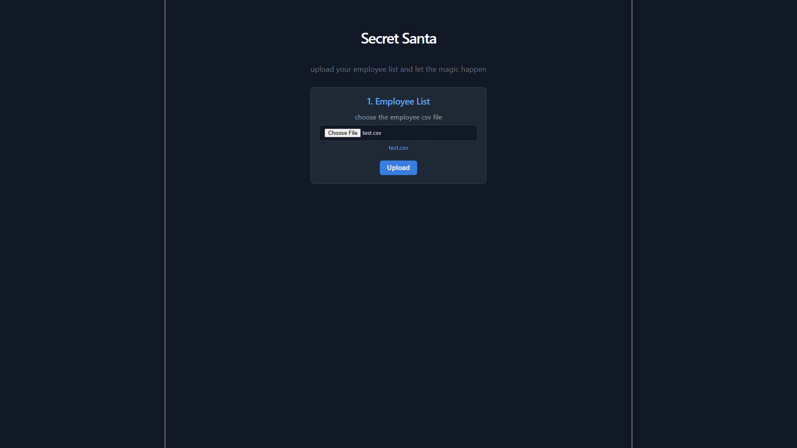

# Secret Santa Game

Built this for a coding challenge. its a web app where you upload your company's employee list (csv) and it randomly assigns everyone a secret santa partner.

Topic Covered:
- Nobody gets assigned to themselves
- Nobody gets the same person they had last year
- Nveryone gives exactly one gift and receives exactly one

## what i used

- Node + Express for the backend
- MongoDB for storing employees and assignments
- React (vite) for the frontend
- Jest for tests

## how it works

You upload a csv with employee names and emails. the app parses it, stores the data, and runs a shuffle-based algorithm to pair everyone up. You can also upload last year's assignments so it avoids repeating the same pairs. once done you can download the results as a new csv.

If someone ends up with themselves or with their previous year match, it reshuffles and tries again. with 15 people it usually works on the first or second try.

## Screenshots for app

(screenshots/Screenshot-2.png)
(screenshots/Screenshot-3.png)
(screenshots/Screenshot-4.png)
(screenshots/Screenshot-5.png)
(screenshots/Screenshot-6.png)
(screenshots/Screenshot-7.png)

## Prerequisites

- Node.js v16 or higher
- MongoDB (running locally or a cloud instance)
- npm

### 1. Clone the repository

- git clone https://github.com/piyushbhai/secret-santa.git
- cd secret-santa

## Installation & Setup

## Frontend in local development
- cd client
- npm install or npm i
- npm run dev

## Backend in local development
- cd server
- npm install or npm i
- npm run dev

## Backend Details
- PORT=5000
- MONGO_URI=mongodb://localhost:27017/secretsanta
